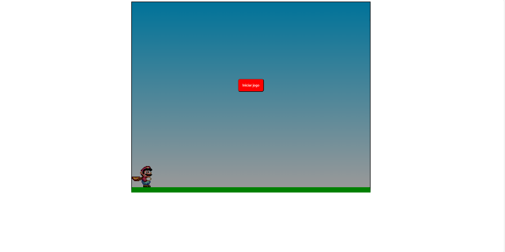

# Mini jogo do mario | Mario Mini Game

## Introdução
Esse projeto foi feito para fins de estudo.

Foi feito com:
- CSS - Utilizado para estilizar elementos escritos em uma linguagem de marcação, como o HTML.
- CSS Animation - Propriedade CSS que serve basicamente para animar outras propriedades CSS
- Javascript - Linguagem de programação utilizada para implementar itens complexos no jogo.
- HTML - Linguagem de marcação

## Introduction
This project was done for study purposes.
 
It was made with:
- CSS - Used to style elements written in a markup language, such as HTML.
- CSS Animation - CSS property that is basically used to animate other CSS properties
- Javascript - Programming language used to implement complex items in the game.
- HTML - Markup Language

